# Evidências de Execução - GlobalSoluction

## 1. Swagger com endpoints

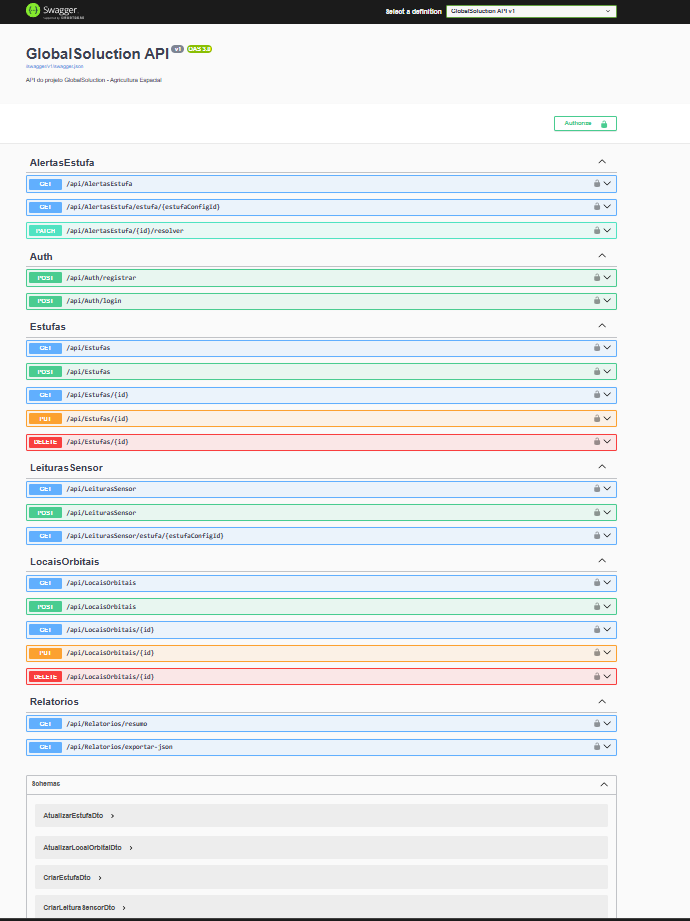

## 2. Login com JWT

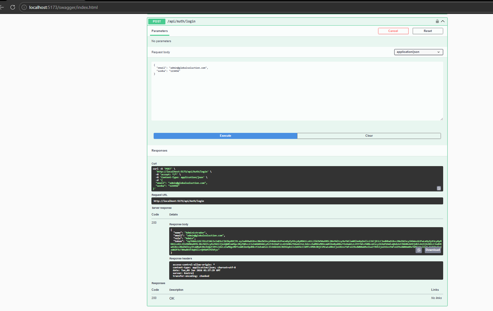

## 3. Swagger Authorize com token

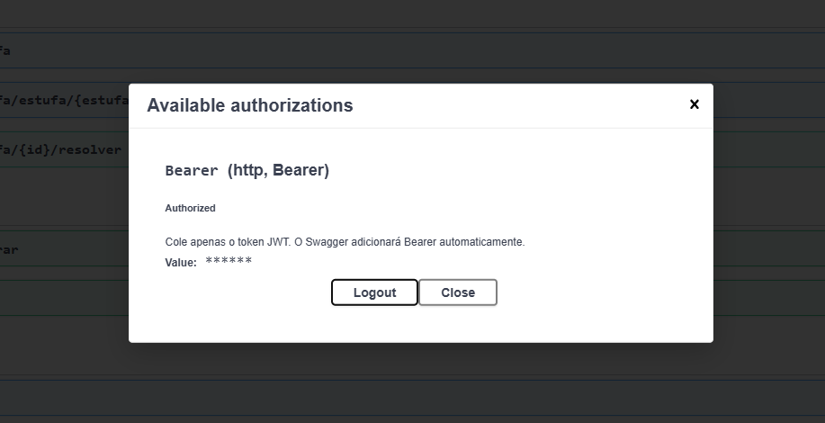

## 4. LocalOrbital funcionando

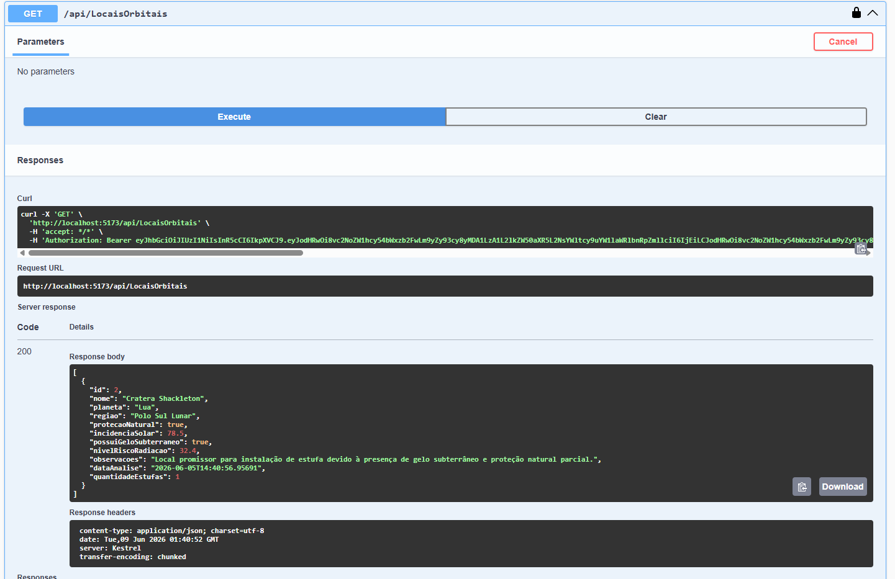

## 5. Estufa funcionando

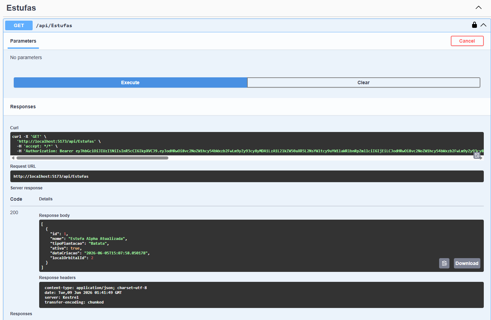

## 6. Leitura normal

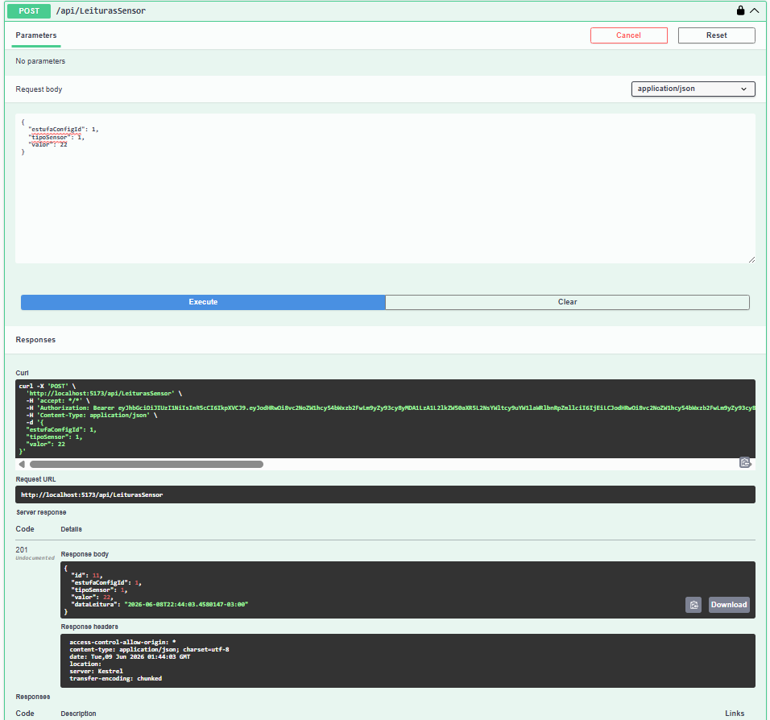

## 7. Leitura fora do ideal

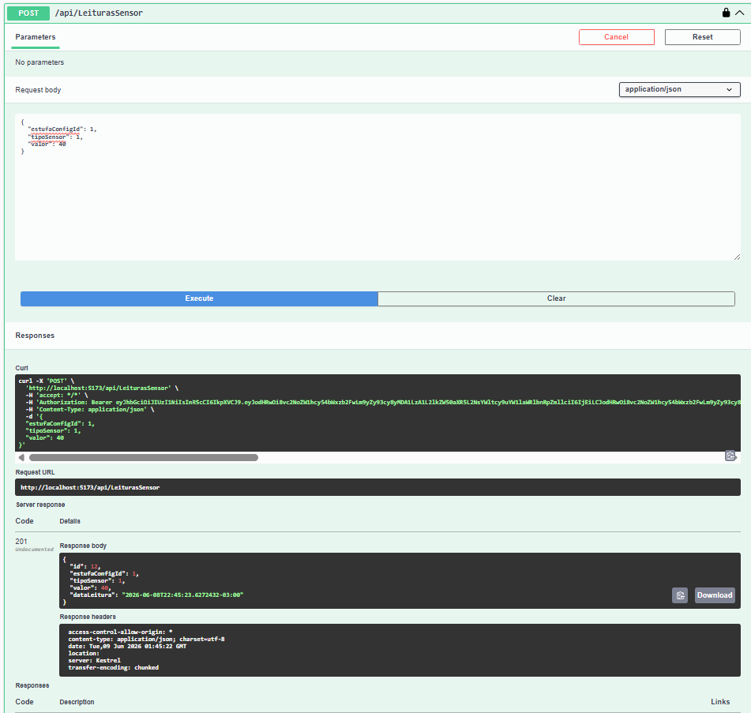

## 8. Alerta gerado automaticamente

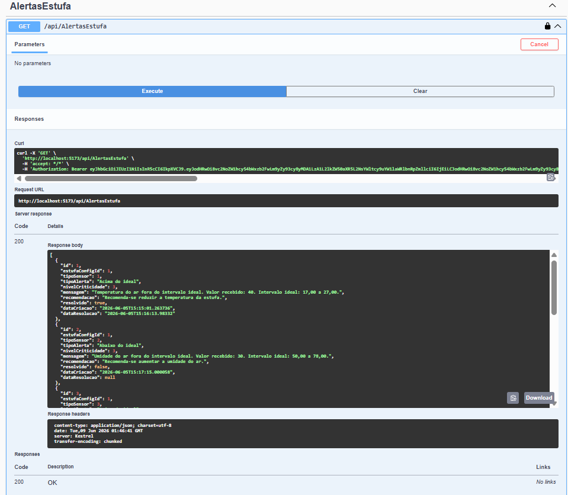

## 9. Alerta resolvido

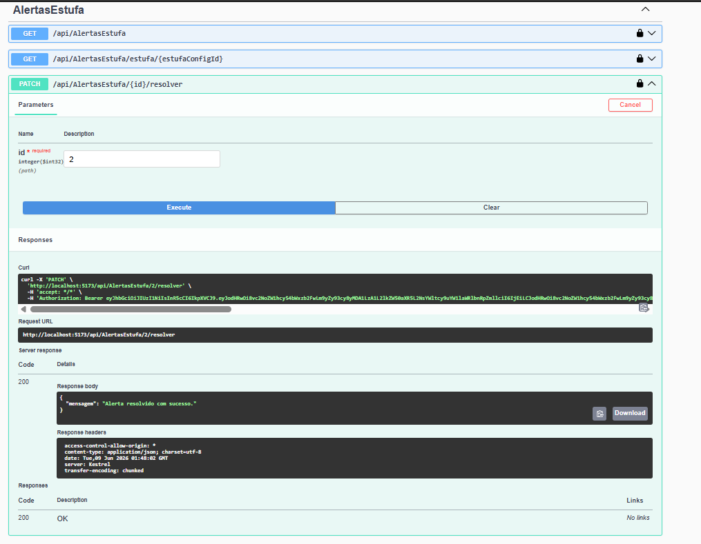
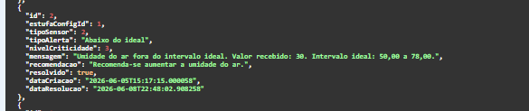

## 10. Relatório resumo

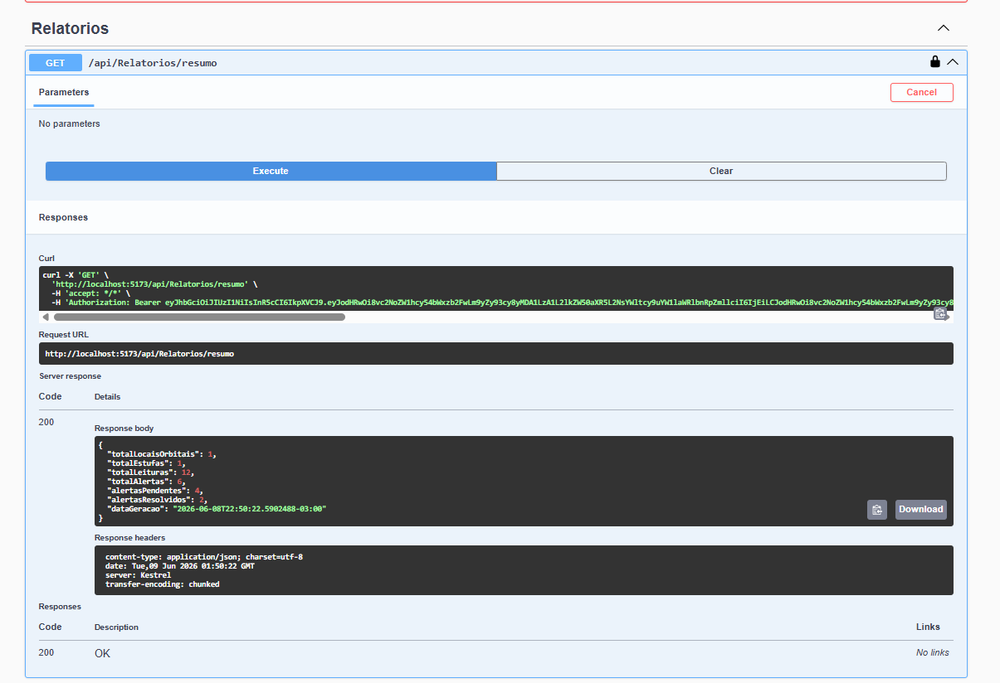

## 11. Exportação JSON

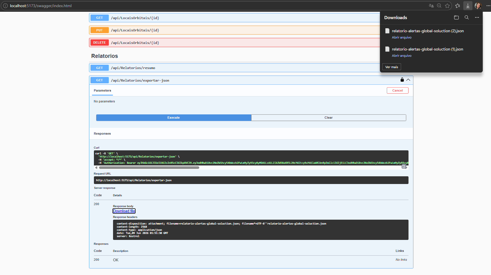

## 12. Tratamento de erro - LocalOrbital inexistente

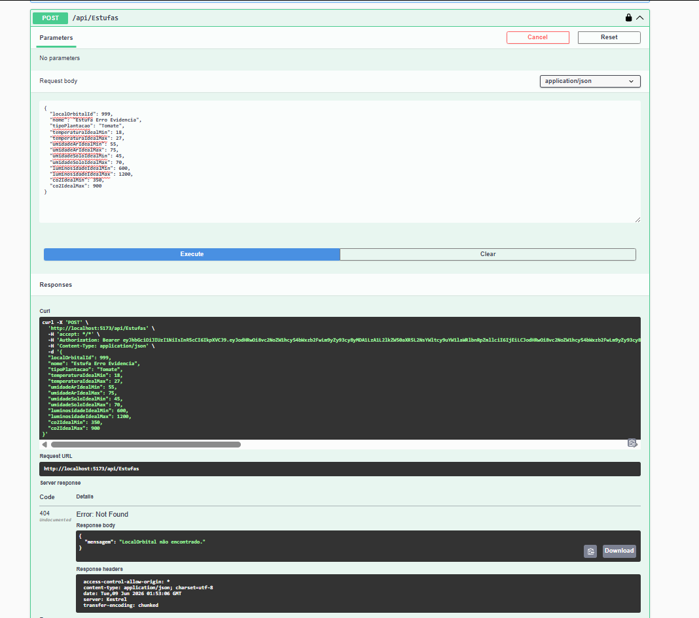

## 13. Tratamento de erro - Estufa inexistente

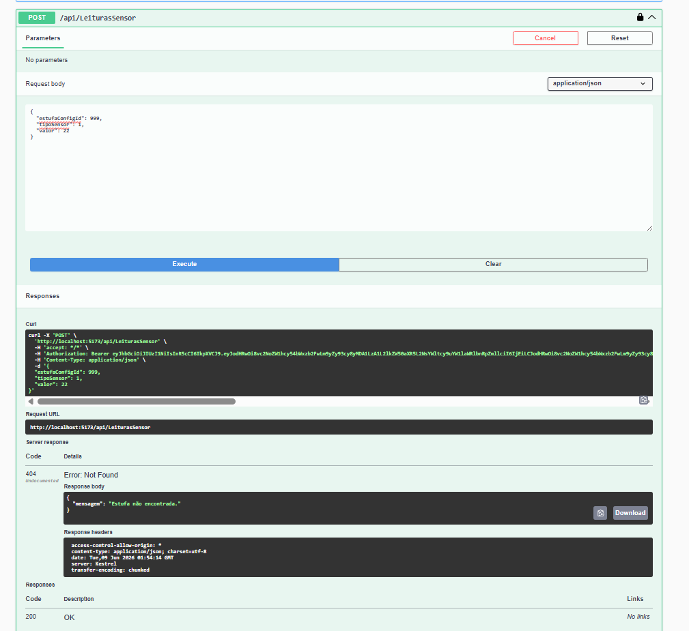

## 14. Endpoint protegido sem token

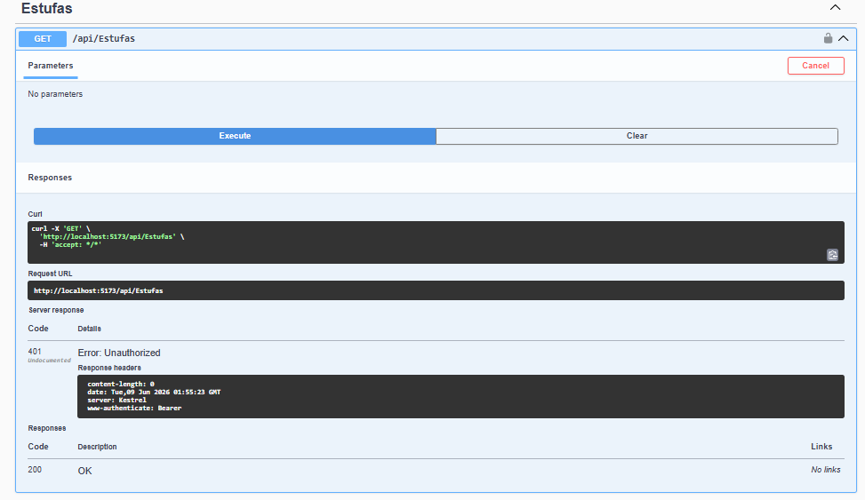

## 15. Build do projeto sem erros

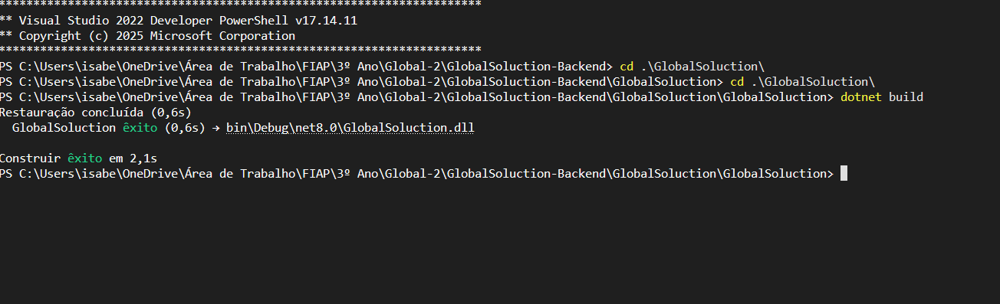
